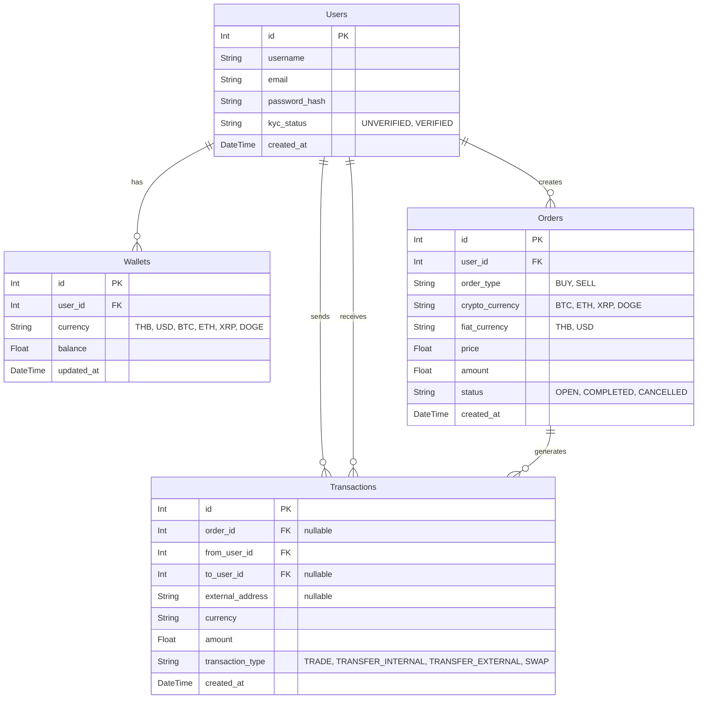

# Crypto C2C API

This is a backend REST API for a Customer-to-Customer (C2C) Cryptocurrency Exchange built with Node.js, Express, and Prisma (SQLite). 

## 📌 Features (ระบบที่รองรับทั้งหมด)

ระบบถูกออกแบบมาเพื่อรองรับการแลกเปลี่ยนแบบ P2P/C2C อย่างเต็มรูปแบบ พร้อมระบบตรวจสอบความปลอดภัย (Balance Validation) และป้องกันปัญหา Race Condition ด้วย Database Transactions

### 1. ระบบผู้ใช้งานและกระเป๋าเงิน (User & Wallet)
- **Auto-Wallet Generation:** เมื่อสมัครสมาชิก ระบบจะสร้างกระเป๋าเงินตั้งต้นให้ครบ 6 สกุลอัตโนมัติ (THB, USD, BTC, ETH, XRP, DOGE) พร้อมยอดเงิน `balance: 0`
- **User Profile:** สามารถเรียกดูข้อมูลผู้ใช้และยอดเงินคงเหลือในกระเป๋าทุกสกุลได้ทันที

### 2. ระบบตลาดซื้อขาย (C2C Order System)
- **Create Order (BUY/SELL):** สร้างประกาศรับซื้อหรือประกาศขาย ได้ทั้ง 4 สกุล Crypto โดยอ้างอิงราคาเป็น Fiat (THB, USD)
- **Balance Validation:** มีกลไกป้องกันการตั้งออเดอร์มั่ว:
  - หากตั้งขาย (SELL) ระบบจะเช็กว่ามีเหรียญ Crypto ในกระเป๋าพอหรือไม่
  - หากตั้งซื้อ (BUY) ระบบจะเช็กว่ามีเงิน Fiat ในกระเป๋าพอจ่ายหรือไม่
- **Market Board:** เรียกดูรายการออเดอร์ทั้งหมดที่สถานะยังเป็น `OPEN` เพื่อรอคนมาจับคู่

### 3. ระบบจับคู่และเทรด (Trade Engine)
- **Execute Trade:** ระบบจับคู่ออเดอร์ (Matching) ซื้อ-ขาย ระหว่าง User
- **Atomic Transaction:** ใช้ `prisma.$transaction` คุมจังหวะการหักเงินคนซื้อและโอนเหรียญให้คนขาย ทำให้ปลอดภัย 100% (ข้อมูลไม่พังเวลาคนกดยิง API รัวพร้อมกัน)
- ป้องกันการซื้อออเดอร์ของตัวเอง (Self-trade Prevention)

### 4. ระบบธุรกรรมและการโอนเงิน (Transactions)
- **Internal Transfer:** โอนเงิน Fiat หรือ Crypto ให้ User คนอื่นภายในระบบเดียวกัน (P2P Transfer) พร้อมระบบช่วยเปิดกระเป๋าให้ผู้รับหากเขายังไม่มี
- **External Transfer:** ถอนเหรียญหรือเงินโอนออกไปยัง Address ภายนอกระบบ (`external_address`)
- **Currency Swap:** ระบบแปลงสกุลเงินด่วน (Fiat <-> Fiat) เช่น แลก THB เป็น USD ตามเรตของแพลตฟอร์ม 
- **Transaction History:** ดูประวัติการทำธุรกรรมย้อนหลังของแต่ละคนได้ ทั้ง Trade, Transfer และ Swap

---

## 📊 ER Diagram (Entity-Relationship)



---

## ⚠️ Technical Note (ข้อควรรู้เรื่องชนิดข้อมูลทศนิยม)
เนื่องจากโปรเจ็กต์นี้ออกแบบมาให้โฮสต์และรันทดสอบได้ง่ายที่สุด จึงเลือกใช้ฐานข้อมูล **SQLite** ทำให้ชนิดข้อมูลตัวเลขถูกบังคับให้ใช้เป็น `Float` แทน `Decimal`
*ซึ่งอาจส่งผลให้เห็นยอดเงินทศนิยมลึกๆ มีความคลาดเคลื่อน (Precision Error) เล็กน้อยในฐานข้อมูล เช่น `0.89999999...`* 

> **หากนำระบบนี้ไปใช้จริงบน Production:** ระบบจะต้องถูกเปลี่ยนไปใช้ฐานข้อมูลที่รองรับความแม่นยำสูง (เช่น PostgreSQL) และเปลี่ยน Data Type เป็น `Decimal` ควบคู่กับการใช้ Math Library ในฝั่ง Backend เพื่อควบคุมทศนิยมของการเงินให้แม่นยำ 100%

---

## ⚙️ Setup Instructions (วิธีรันโปรเจ็กต์)

1. **Install dependencies:**
   ```bash
   npm install
   ```

2. **Initialize Database (SQLite):**
   *(ฐานข้อมูลจะถูกสร้างเป็นไฟล์ `dev.db` ภายในโปรเจ็กต์)*
   ```bash
   npx prisma format
   npx prisma db push
   ```

3. **Seed Initial Test Data (จำลองข้อมูลเริ่มต้น):**
   ```bash
   npx prisma db seed
   ```
   *คำสั่งนี้จะสร้าง User 2 คน พร้อมกระเป๋าทุกสกุล เติมเงินให้ 3,000,000 THB และสร้าง Order ตั้งขาย/รับซื้อรอไว้เลยเพื่อให้กรรมการทดสอบระบบได้ทันที*

4. **Run the Server:**
   ```bash
   npm run dev
   ```
   *เปิดเซิร์ฟเวอร์ที่ http://localhost:3000*

5. **(Optional) View Database with UI:**
   ```bash
   npx prisma studio
   ```

---

## 📡 API Endpoints Summary

| หมวดหมู่ (Category) | Method | Endpoint | หน้าที่ (Description) |
| :--- | :--- | :--- | :--- |
| **Users** | `POST` | `/api/users` | สมัครสมาชิกใหม่ |
| **Users** | `GET` | `/api/users/:id` | ดู Profile และยอดเงิน Wallet |
| **Orders** | `GET` | `/api/orders` | ดูรายการรับซื้อ-ขายในตลาด (`OPEN`) |
| **Orders** | `POST` | `/api/orders` | สร้างโพสต์ขายตลาด (SELL) หรือรับซื้อ (BUY) |
| **Orders** | `POST` | `/api/orders/trade` | จับคู่ออเดอร์เทรด (Trade Engine) |
| **Transactions** | `POST` | `/api/transactions/transfer` | โอนหากันภายในระบบ |
| **Transactions** | `POST` | `/api/transactions/transfer-external`| โอนออกนอกระบบ |
| **Transactions** | `POST` | `/api/transactions/swap` | แปลงสกุลเงินทันที |
| **Transactions** | `GET` | `/api/transactions/user/:id` | ดูประวัติทำรายการย้อนหลัง |
| **Bonus** | `GET` | `/api/transactions/rates` | ดูเรตราคาอ้างอิงของแพลตฟอร์ม |

---

## 📖 Detailed API Documentation

### 1. 👤 Users / Authentication

#### 1.1 Create User (Register)
- **Method:** `POST`
- **URL:** `/api/users`
- **Description:** สมัครสมาชิกใหม่ ระบบจะทำการสร้าง Wallet เปล่าให้ครบ 6 สกุลอัตโนมัติ (THB, USD, BTC, ETH, XRP, DOGE)
- **Body (raw JSON):**
```json
{
  "username": "NewTrader99",
  "email": "newtrader@example.com",
  "password_hash": "secure_password_hash"
}
```

#### 1.2 Get User Profile & Wallets
- **Method:** `GET`
- **URL:** `/api/users/:id`
- **Description:** เรียกดูข้อมูล User และยอดเงินคงเหลือในทุกกระเป๋า (Wallet Balances)
- **Body:** *None*

---

### 2. 🛒 Orders / Market Board

#### 2.1 Get Open Orders
- **Method:** `GET`
- **URL:** `/api/orders`
- **Description:** เรียกดูออเดอร์ในตลาดทั้งหมดที่มีสถานะ `OPEN` เพื่อรอคนมากดจับคู่เทรด
- **Body:** *None*

#### 2.2 Create Trade Order (BUY or SELL)
- **Method:** `POST`
- **URL:** `/api/orders`
- **Description:** สร้างออเดอร์ตั้งรับซื้อ (`BUY`) หรือตั้งขาย (`SELL`) มีระบบ Balance Validation เช็กยอดเงินก่อน
- **Body (raw JSON) - Example for SELL Order:**
```json
{
  "user_id": 2,
  "order_type": "SELL",
  "crypto_currency": "BTC",
  "fiat_currency": "THB",
  "price": 2500000,
  "amount": 0.1
}
```

#### 2.3 Execute Trade (Match Orders)
- **Method:** `POST`
- **URL:** `/api/orders/trade`
- **Description:** กดจับคู่ออเดอร์เทรด (C2C Matching) ระบบจะหักเงินคนซื้อและโอนเหรียญให้แบบ Atomic Database Transaction
- **Body (raw JSON):**
```json
{
  "order_id": 1,
  "buyer_id": 1
}
```

---

### 3. 💸 Transactions & Transfers

#### 3.1 Internal Transfer (P2P)
- **Method:** `POST`
- **URL:** `/api/transactions/transfer`
- **Description:** โอนเงินระหว่าง User ภายในระบบเดียวกัน (ถ้าผู้รับไม่มีกระเป๋าสกุลนั้น ระบบจะ Auto-create ให้)
- **Body (raw JSON):**
```json
{
  "from_user_id": 1,
  "to_user_id": 2,
  "currency": "THB",
  "amount": 5000.50
}
```

#### 3.2 External Transfer (Withdrawal)
- **Method:** `POST`
- **URL:** `/api/transactions/transfer-external`
- **Description:** โอนถอนเหรียญออกจากระบบไปยัง Address ภายนอก 
- **Body (raw JSON):**
```json
{
  "from_user_id": 2,
  "currency": "BTC",
  "amount": 0.5,
  "external_address": "bc1qxy2kgdygjrsqtzq2n0yrf2493p83kkfjhx0wlh"
}
```

#### 3.3 Swap Currency (Instant Convert)
- **Method:** `POST`
- **URL:** `/api/transactions/swap`
- **Description:** ระบบแลกเปลี่ยนเงินด่วนแบบไม่ต้องตั้งออเดอร์เทรด (เช่น แลก THB กลับไปมาระหว่าง USD) 
- **Body (raw JSON):**
```json
{
  "user_id": 1,
  "from_currency": "THB",
  "to_currency": "USD",
  "amount": 350
}
```

#### 3.4 Get User Transactions (Statement)
- **Method:** `GET`
- **URL:** `/api/transactions/user/:id`
- **Description:** เรียกดูประวัติการทำธุรกรรม (Statement) ไม่ว่าจะเป็นการโอนเข้า โอนออก เทรด หรือ Swap โดยเรียงลำดับใหม่ไปเก่า
- **Body:** *None*

#### 3.5 Get Reference Rates (Bonus)
- **Method:** `GET`
- **URL:** `/api/transactions/rates`
- **Description:** ดึงข้อมูลอัตราแลกเปลี่ยน Reference rate ส่วนกลางจากไฟล์ `rates.js` ของระบบ
- **Body:** *None*
