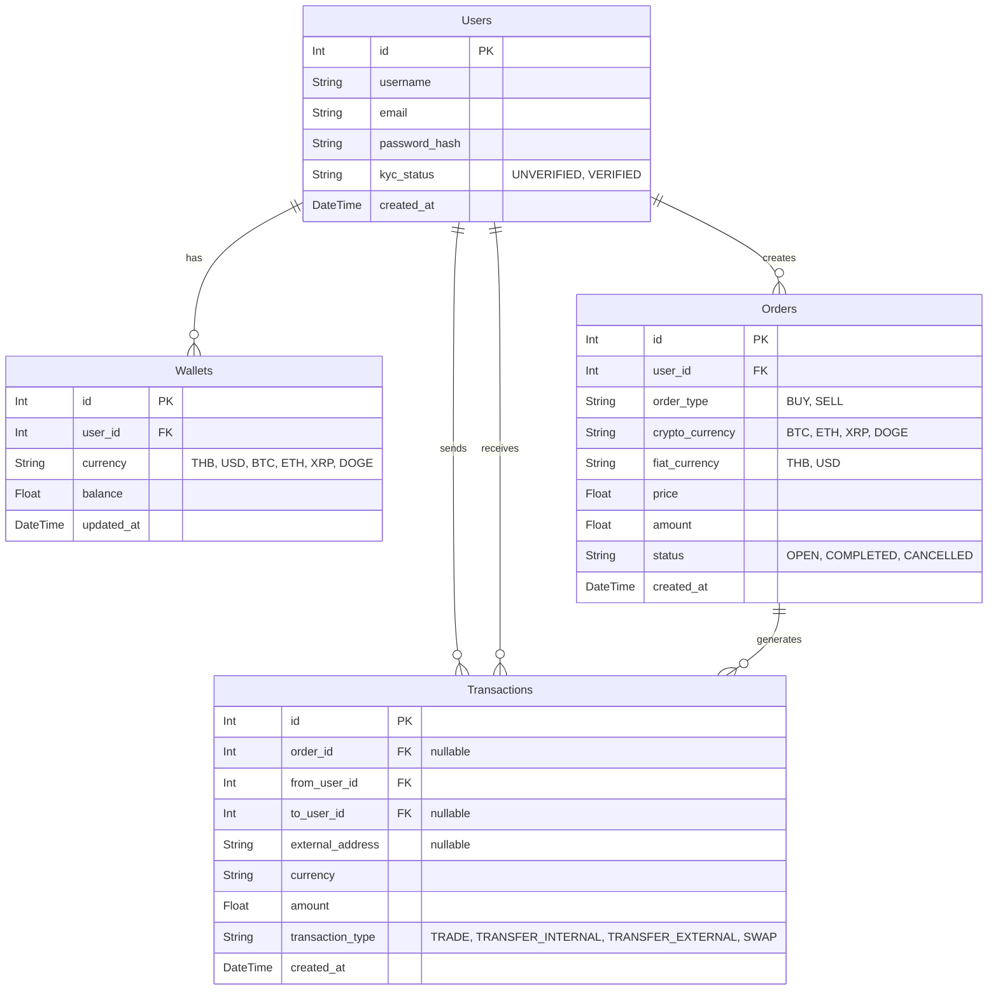

# Crypto C2C API

This is a backend REST API for a Customer-to-Customer (C2C) Cryptocurrency Exchange built with Node.js, Express, and Prisma (SQLite). 

## 📌 Features (ระบบที่รองรับทั้งหมด)

ระบบถูกออกแบบมาเพื่อรองรับการแลกเปลี่ยนแบบ P2P/C2C อย่างเต็มรูปแบบ พร้อมระบบตรวจสอบความปลอดภัย (Balance Validation) และป้องกันปัญหา Race Condition ด้วย Database Transactions

### 1. ระบบผู้ใช้งานและกระเป๋าเงิน (User & Wallet)
- **Auto-Wallet Generation:** เมื่อสมัครสมาชิก ระบบจะสร้างกระเป๋าเงินตั้งต้นให้ครบ 6 สกุลอัตโนมัติ (THB, USD, BTC, ETH, XRP, DOGE) พร้อมยอดเงิน `balance: 0`
- **User Profile:** สามารถเรียกดูข้อมูลผู้ใช้และยอดเงินคงเหลือในกระเป๋าทุกสกุลได้ทันที

### 2. ระบบตลาดซื้อขาย (C2C Order System)
- **Create Order (BUY/SELL):** สร้างประกาศรับซื้อหรือประกาศขาย ได้ทั้ง 4 สกุล Crypto โดยอ้างอิงราคาเป็น Fiat (THB, USD)
- **Balance Validation:** มีกลไกป้องกันการตั้งออเดอร์มั่ว:
  - หากตั้งขาย (SELL) ระบบจะเช็กว่ามีเหรียญ Crypto ในกระเป๋าพอหรือไม่
  - หากตั้งซื้อ (BUY) ระบบจะเช็กว่ามีเงิน Fiat ในกระเป๋าพอจ่ายหรือไม่
- **Market Board:** เรียกดูรายการออเดอร์ทั้งหมดที่สถานะยังเป็น `OPEN` เพื่อรอคนมาจับคู่

### 3. ระบบจับคู่และเทรด (Trade Engine)
- **Execute Trade:** ระบบจับคู่ออเดอร์ (Matching) ซื้อ-ขาย ระหว่าง User
- **Atomic Transaction:** ใช้ `prisma.$transaction` คุมจังหวะการหักเงินคนซื้อและโอนเหรียญให้คนขาย ทำให้ปลอดภัย 100% (ข้อมูลไม่พังเวลาคนกดยิง API รัวพร้อมกัน)
- ป้องกันการซื้อออเดอร์ของตัวเอง (Self-trade Prevention)

### 4. ระบบธุรกรรมและการโอนเงิน (Transactions)
- **Internal Transfer:** โอนเงิน Fiat หรือ Crypto ให้ User คนอื่นภายในระบบเดียวกัน (P2P Transfer) พร้อมระบบช่วยเปิดกระเป๋าให้ผู้รับหากเขายังไม่มี
- **External Transfer:** ถอนเหรียญหรือเงินโอนออกไปยัง Address ภายนอกระบบ (`external_address`)
- **Currency Swap:** ระบบแปลงสกุลเงินด่วน (Fiat <-> Fiat) เช่น แลก THB เป็น USD ตามเรตของแพลตฟอร์ม 
- **Transaction History:** ดูประวัติการทำธุรกรรมย้อนหลังของแต่ละคนได้ ทั้ง Trade, Transfer และ Swap

---

## 📊 ER Diagram (Entity-Relationship)



---

## ⚠️ Technical Note (ข้อควรรู้เรื่องชนิดข้อมูลทศนิยม)
เนื่องจากโปรเจ็กต์นี้ออกแบบมาให้โฮสต์และรันทดสอบได้ง่ายที่สุด จึงเลือกใช้ฐานข้อมูล **SQLite** ทำให้ชนิดข้อมูลตัวเลขถูกบังคับให้ใช้เป็น `Float` แทน `Decimal`
*ซึ่งอาจส่งผลให้เห็นยอดเงินทศนิยมลึกๆ มีความคลาดเคลื่อน (Precision Error) เล็กน้อยในฐานข้อมูล เช่น `0.89999999...`* 

> **หากนำระบบนี้ไปใช้จริงบน Production:** ระบบจะต้องถูกเปลี่ยนไปใช้ฐานข้อมูลที่รองรับความแม่นยำสูง (เช่น PostgreSQL) และเปลี่ยน Data Type เป็น `Decimal` ควบคู่กับการใช้ Math Library ในฝั่ง Backend เพื่อควบคุมทศนิยมของการเงินให้แม่นยำ 100%

---

## ⚙️ Setup Instructions (วิธีรันโปรเจ็กต์)

1. **Install dependencies:**
   ```bash
   npm install
   ```

2. **Initialize Database (SQLite):**
   *(ฐานข้อมูลจะถูกสร้างเป็นไฟล์ `dev.db` ภายในโปรเจ็กต์)*
   ```bash
   npx prisma format
   npx prisma db push
   ```

3. **Seed Initial Test Data (จำลองข้อมูลเริ่มต้น):**
   ```bash
   npx prisma db seed
   ```
   *คำสั่งนี้จะสร้าง User 2 คน พร้อมกระเป๋าทุกสกุล เติมเงินให้ 3,000,000 THB และสร้าง Order ตั้งขาย/รับซื้อรอไว้เลยเพื่อให้กรรมการทดสอบระบบได้ทันที*

4. **Run the Server:**
   ```bash
   npm run dev
   ```
   *เปิดเซิร์ฟเวอร์ที่ http://localhost:3000*

5. **(Optional) View Database with UI:**
   ```bash
   npx prisma studio
   ```

---

## 📡 API Endpoints Summary

| หมวดหมู่ (Category) | Method | Endpoint | หน้าที่ (Description) |
| :--- | :--- | :--- | :--- |
| **Users** | `POST` | `/api/users` | สมัครสมาชิกใหม่ |
| **Users** | `GET` | `/api/users/:id` | ดู Profile และยอดเงิน Wallet |
| **Orders** | `GET` | `/api/orders` | ดูรายการรับซื้อ-ขายในตลาด (`OPEN`) |
| **Orders** | `POST` | `/api/orders` | สร้างโพสต์ขายตลาท (SELL) หรือรับซื้อ (BUY) |
| **Orders** | `POST` | `/api/orders/trade` | จับคู่ออเดอร์เทรด (Trade Engine) |
| **Transactions** | `POST` | `/api/transactions/transfer` | โอนหากันภายในระบบ |
| **Transactions** | `POST` | `/api/transactions/transfer-external`| โอนออกนอกระบบ |
| **Transactions** | `POST` | `/api/transactions/swap` | แปลงสกุลเงินทันที |
| **Transactions** | `GET` | `/api/transactions/user/:id` | ดูประวัติทำรายการย้อนหลัง |
